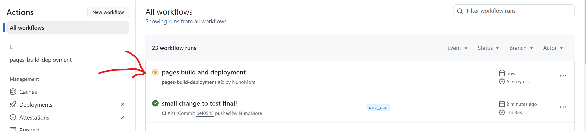

# Welcome to your PP2 app 👋

This is an [Expo](https://expo.dev) project created with [`create-expo-app`](https://www.npmjs.com/package/create-expo-app).

## Get started

1. Install dependencies

   ```bash
   npm install
   ```

2. Start the app

   ```bash
    npm start
   ```

3. View app

   - just press "w" for web browser
   - alternatively for ios or android testing, [`download Expo Go app`](https://expo.dev/go) and scan the QR code provided before by "npm start"

4. Pull changes

   ```bash
    git pull
   ```

5. Add changes

   ```bash
    git commit -m "some message"
    git add .
    git push
   ```

   - this done for the branch "dev_css" will automatically trigger the action to deploy (number 5)
   - you can verify the action in the ACTIONS tab in github. It should take 2 or 3 minutes to deploy your changes
     

6. Deploy app (github pages)

   ```bash
    npm run deploy
   ```

   - note that it needs to finish a github action first.
   - you can see the code here: [pp2-app](https://nunomore.github.io/pp2-app/)

## Learn more

To learn more about developing your project with Expo, look at the following resources:

- [Expo documentation](https://docs.expo.dev/): Learn fundamentals, or go into advanced topics with our [guides](https://docs.expo.dev/guides).
- [Learn Expo tutorial](https://docs.expo.dev/tutorial/introduction/): Follow a step-by-step tutorial where you'll create a project that runs on Android, iOS, and the web.
